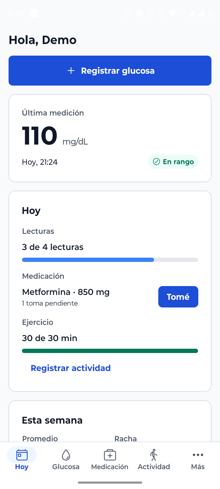
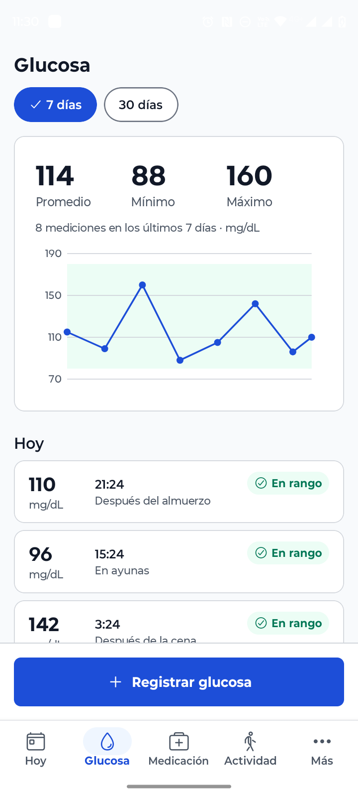
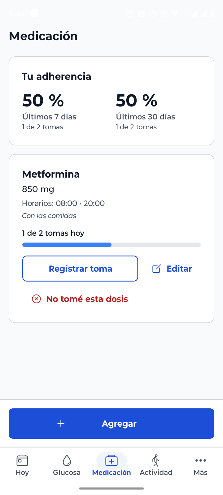
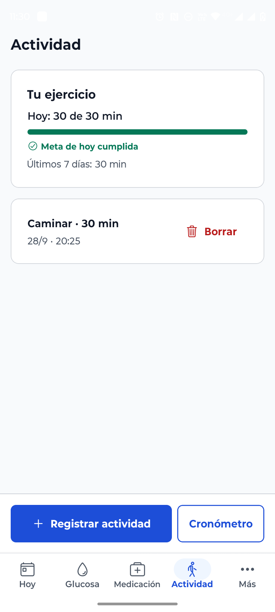
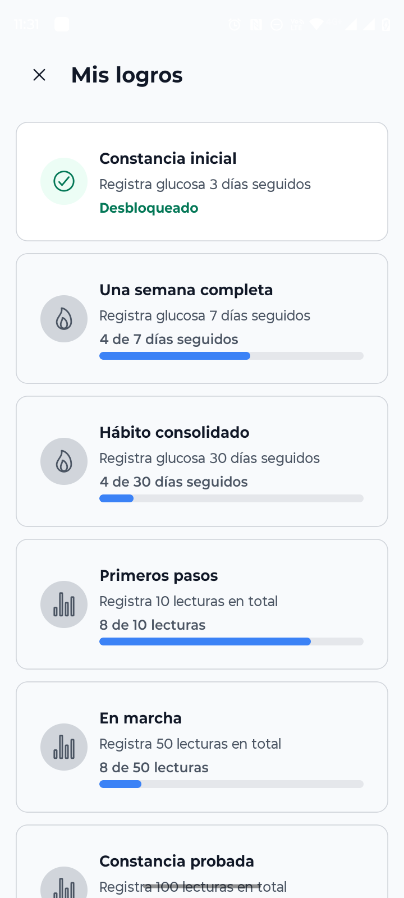
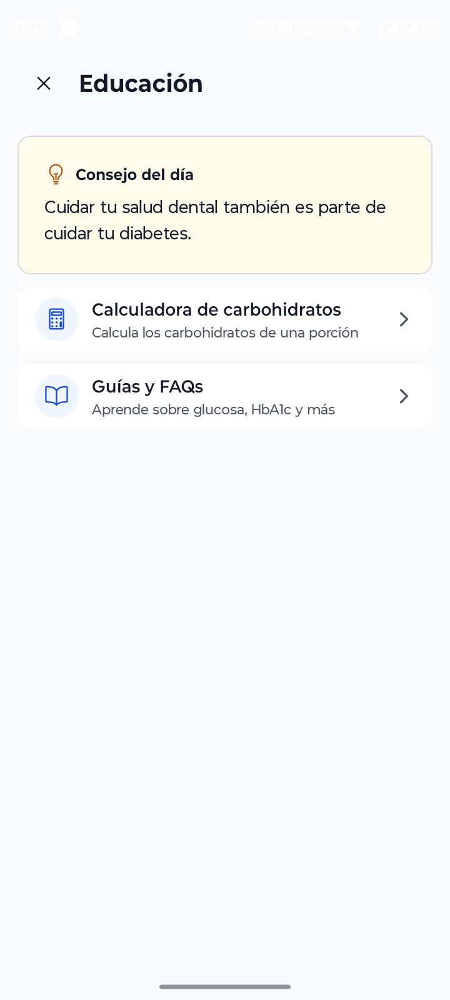

# 🩸 DiabetApp

Una aplicación móvil completa para el seguimiento y gestión de la diabetes, construida con React Native (Expo) y Node.js. El backend está en producción en [Render](https://diabetapp-backend.onrender.com) + [Neon](https://neon.tech).

## 📋 Descripción

DiabetApp es una solución integral que ayuda a las personas con diabetes a monitorear sus niveles de glucosa, su medicación, su actividad física y su avance hacia sus metas. La aplicación está diseñada con un enfoque en la usabilidad, con recordatorios locales, contenido educativo y un sistema de logros que motiva la constancia diaria.

## 📸 Capturas

| Hoy | Glucosa | Medicación |
| --- | --- | --- |
|  |  |  |

| Actividad | Logros | Educación |
| --- | --- | --- |
|  |  |  |

## ✨ Características Principales

### 🔐 Autenticación y Seguridad

- Registro e inicio de sesión con JWT de 15 min + token de renovación opaco de 30 días (rotación y revocación de cadena de sesión)
- Contraseñas con bcrypt, `helmet`, rate limiting en login/registro/refresh y protección contra IDOR
- Revisado contra OWASP Top 10

### 📊 Glucosa

- Registro de lecturas con momento del día y notas, promedios de 7/14/30 días y proyección de HbA1c
- Gráfico de tendencia, racha de días seguidos y exportación del historial en CSV/PDF
- Recordatorio local opcional 2 horas después de una lectura, para volver a medir

### 💊 Medicación

- CRUD de medicamentos con horarios, registro de tomas y % de adherencia de 7/30 días
- Motivo opcional al registrar que **no** se tomó una dosis

### 🏃 Actividad

- Registro de ejercicio (con cronómetro) y comparación de glucosa en días con/sin ejercicio

### 🏆 Logros y 📚 Educación

- Catálogo de logros por racha y por lecturas totales
- Consejo del día, calculadora de carbohidratos y guías/FAQs (contenido local, sin backend)

### 🔔 Notificaciones locales

- Recordatorios de medicación, glucosa y motivacionales, sincronizados desde el perfil (sin servidor push)

### 👤 Perfil y metas

- Tipo de diabetes, rangos de glucosa y HbA1c, metas de lecturas diarias y minutos de ejercicio

## 🏗️ Arquitectura del Proyecto

Monorepo con dos proyectos independientes (sin workspaces), cada uno con su propio `package.json`:

```
diabetapp-monolith/
├── diabetapp-backend/     # API REST: Express 5 + TypeScript + Prisma + PostgreSQL
├── diabetapp-frontend/    # App Expo (SDK 57) con Expo Router
├── specs/                 # Especificaciones del proceso SDD (spec → plan → tareas)
└── scripts/dev.sh         # Automatización de desarrollo local (make up/build/release)
```

### Backend (`diabetapp-backend/`)

- **Framework**: Express 5 + TypeScript (CommonJS)
- **Base de datos**: PostgreSQL con Prisma ORM (Neon en producción)
- **Autenticación**: JWT + bcrypt, refresh tokens con hash SHA-256
- **Validación**: Zod 4
- **Despliegue**: Render (Web Service, plan gratuito), migraciones en `startCommand`

### Frontend (`diabetapp-frontend/`)

- **Framework**: Expo SDK 57 + React Native 0.86 + React 19.2
- **Navegación**: Expo Router (file-based), 5 pestañas principales
- **Formularios**: react-hook-form + Zod
- **HTTP Client**: Axios (con reintento automático ante *cold start* del backend)
- **Notificaciones**: expo-notifications (solo en development build, no en Expo Go)

## 📱 Probar la app

Ver `CLAUDE.md` para los comandos completos. En resumen:

- **Celular por USB/WiFi**: `make doctor` y luego `make up` (requiere Docker y `make`)
- **Solo backend + frontend en local**: `docker compose up -d` en `diabetapp-backend/` y `npm run dev`; `npm start` en `diabetapp-frontend/`
- **Contra producción sin nada local**: cambia `EXPO_PUBLIC_API_URL` en `diabetapp-frontend/.env` a `https://diabetapp-backend.onrender.com/api`

## 🔒 Seguridad

- Contraseñas con bcrypt, JWT de corta duración + refresh token hasheado y rotado
- Validación de datos con Zod en cada capa, `helmet`, rate limiting, límite de tamaño de body
- Recursos de usuario siempre filtrados por `userId`; una lectura ajena responde `NOT_FOUND` (no `FORBIDDEN`)
- Revisión completa contra OWASP Top 10, con corrección de una vulnerabilidad de firma HMAC en una dependencia (`npm audit fix`)

## 🛠️ Tecnologías Utilizadas

### Backend

- **Express 5**, **Prisma 6**, **PostgreSQL**, **Zod 4**, **JWT**, **bcrypt**, **TypeScript**
- **Render** + **Neon** para producción

### Frontend

- **Expo SDK 57**, **React Native 0.86**, **Expo Router**, **TypeScript**
- **Axios**, **react-hook-form**, **expo-notifications**, **react-native-svg**

## 📄 Licencia

Este proyecto está bajo la Licencia ISC.

---

**DiabetApp** - Tu compañero digital para el manejo de la diabetes 💙
